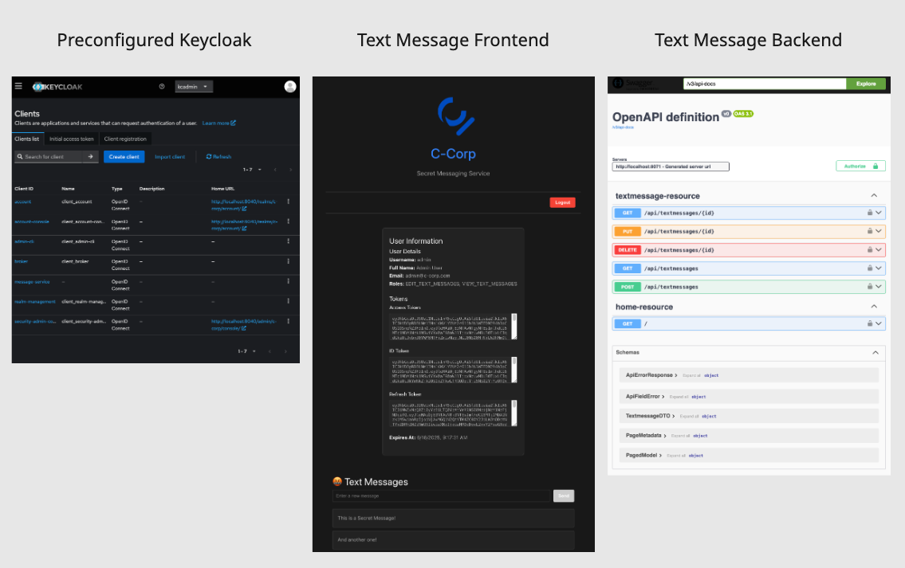

# From Zero to SSO Hero 🦸
## Expert Exchange Event - Workshop


https://www.cloudflight.io/en/event/expert-exchange/

> Let’s face it - most authentication setups in our company are inherited, rarely revisited, and often become siloed knowledge over time. This makes them harder to understand, improve, and modernize, potentially creating gaps in security or user experience. 🔓

This workshop will:
- Demystify authentication and authorization concepts
- Provide hands-on experience with Keycloak and OIDC
- Guide you through implementing secure applications

**By the end**: You'll understand how to implement and secure applications using industry-standard protocols.

# Assignment

You can find context and your assignment here: [workshop_slides.pdf](docs/workshop_slides.pdf).

# Architecture and System Overview


[![](https://mermaid.ink/img/pako:eNqdV2tzokgU_StdTM1WpgoNICgyVVtFkJm48ZEVUrOzmg8NNEipQDVNEjeV_77digKCMTN8wT59-xzuuf3ylXNjD3Ea56_jZ3cJMQGj2SIC9Pn8GbRaLfBgmTMLXI3MbzYwpqOH8YQHumFPZ8C61e_NLyxoPyDNnADDZAkeUoRTMAePe5w9XoiRS8I4AvZNgUJvE0ZXc529Hr8UeEYJruaMpoyGEUGYhg9373LPys2Z7gxQIUORt4gq6dyZP43RVL8Df4DBDbgyzIltzvLEmnIZ6mMwH3ooIiHZ0kG666I0BWMYwQBtKHwxyRXauusYruYFxJ67HK6iDUrBhlRj7mNMNKAKslDgj3U9zzmjSBM_JUxJgJH196hJSJE7Uk2obqxl68adOQDWT8s2x3TGzIbfb-2qs8cBtvmPDcamZenfzXzEie82pZjb6IWAMXWBeg2sbUrQ5qLdhI7x0UnqFaJvOKYziCVQDvmBHKAnSbPVvWarmZbzrtYNdFc1qZlp2UC_H57REs9q1Upa0frVsgrChbLqhjF9mNjDyffmGukGmNNZGmd0ykbBRwsEXbdWnxLLb1RHaa4OFXLeEfqN0ijiOaFaZUpCv1wX8UJdrId7umdZpjEzbXDDlt1kcFIai64eK0sQBhZyMSL0hZ9CF12sTprWPKvwNLo2ZpXH24NIs3l94QO7yMwc6fZwOrFuh_dWsR3vtnfQarf-zNf3HmbnRB3dnxN1vESym4OnHCWwTJHDVQ6w4EZxEEYLDrCYVWUzzynfjTkqnI3ax-VHG7Vif7KFzOmUNuuh-1z3lNPhwGjU3WXzTkyVKnfQQZXBe1McVI52imjPOUY7x2gG5hkdjqFyDkX3gYx94RPCob8Ff_2wz-XywUg2qy8GFuuLbNcIkGcEVym4Cn26rJKEzmLk5dcKdw3TdIBox27Lc-IX4IfrtfaJ2iP5Pp8SHK-Q9knodLteN2-2nkOPLDWxrSQvX0s87KjjdYOnS_ZI9_VE5_CRhRISfR_1CqW-2u8ql5QONHxhe5n6VJXN40LR9_2-5xwV_Z7bl9UGxQPkwZTeJzHcakAGUuU7dlOaZ_T8fh3wh2meS3I8F-DQ4zSCM8RzG4Q3kDW5V0az4MiS3r0WnEZ_esiH2ZosuEX0RoclMPo3jjeHkTjOgiWn-XCd0laWeJCgQQjpJrk5QU0vJDE-gjAjsbWN3AMRtchDtPuVI9uEXZgDuhKpnhtHfhgwPMNrCi8JSVLt-pp1t4OQLDOn7cab6zT02O16-dTvXnelrgqlDur2OlDpdDzXEfuqL8mi7_UEUYLc2xv9cro5ImywQ4TTREUVd7kxoRfaVtuqpAj9nqrK_Y4sd7o8t-U0SZXagiRLck_q9QVFEinPfzs3xHanJ6iqSksmy4KiSDyHdgmP99f_3b-At_8BkRd2uw?type=png)](https://mermaid.live/edit#pako:eNqdV2tzokgU_StdTM1WpgoNICgyVVtFkJm48ZEVUrOzmg8NNEipQDVNEjeV_77digKCMTN8wT59-xzuuf3ylXNjD3Ea56_jZ3cJMQGj2SIC9Pn8GbRaLfBgmTMLXI3MbzYwpqOH8YQHumFPZ8C61e_NLyxoPyDNnADDZAkeUoRTMAePe5w9XoiRS8I4AvZNgUJvE0ZXc529Hr8UeEYJruaMpoyGEUGYhg9373LPys2Z7gxQIUORt4gq6dyZP43RVL8Df4DBDbgyzIltzvLEmnIZ6mMwH3ooIiHZ0kG666I0BWMYwQBtKHwxyRXauusYruYFxJ67HK6iDUrBhlRj7mNMNKAKslDgj3U9zzmjSBM_JUxJgJH196hJSJE7Uk2obqxl68adOQDWT8s2x3TGzIbfb-2qs8cBtvmPDcamZenfzXzEie82pZjb6IWAMXWBeg2sbUrQ5qLdhI7x0UnqFaJvOKYziCVQDvmBHKAnSbPVvWarmZbzrtYNdFc1qZlp2UC_H57REs9q1Upa0frVsgrChbLqhjF9mNjDyffmGukGmNNZGmd0ykbBRwsEXbdWnxLLb1RHaa4OFXLeEfqN0ijiOaFaZUpCv1wX8UJdrId7umdZpjEzbXDDlt1kcFIai64eK0sQBhZyMSL0hZ9CF12sTprWPKvwNLo2ZpXH24NIs3l94QO7yMwc6fZwOrFuh_dWsR3vtnfQarf-zNf3HmbnRB3dnxN1vESym4OnHCWwTJHDVQ6w4EZxEEYLDrCYVWUzzynfjTkqnI3ax-VHG7Vif7KFzOmUNuuh-1z3lNPhwGjU3WXzTkyVKnfQQZXBe1McVI52imjPOUY7x2gG5hkdjqFyDkX3gYx94RPCob8Ff_2wz-XywUg2qy8GFuuLbNcIkGcEVym4Cn26rJKEzmLk5dcKdw3TdIBox27Lc-IX4IfrtfaJ2iP5Pp8SHK-Q9knodLteN2-2nkOPLDWxrSQvX0s87KjjdYOnS_ZI9_VE5_CRhRISfR_1CqW-2u8ql5QONHxhe5n6VJXN40LR9_2-5xwV_Z7bl9UGxQPkwZTeJzHcakAGUuU7dlOaZ_T8fh3wh2meS3I8F-DQ4zSCM8RzG4Q3kDW5V0az4MiS3r0WnEZ_esiH2ZosuEX0RoclMPo3jjeHkTjOgiWn-XCd0laWeJCgQQjpJrk5QU0vJDE-gjAjsbWN3AMRtchDtPuVI9uEXZgDuhKpnhtHfhgwPMNrCi8JSVLt-pp1t4OQLDOn7cab6zT02O16-dTvXnelrgqlDur2OlDpdDzXEfuqL8mi7_UEUYLc2xv9cro5ImywQ4TTREUVd7kxoRfaVtuqpAj9nqrK_Y4sd7o8t-U0SZXagiRLck_q9QVFEinPfzs3xHanJ6iqSksmy4KiSDyHdgmP99f_3b-At_8BkRd2uw)
Take a look at [architecture.md](docs/architecture.md).

# Usage and Troubleshooting Guide

## Table of Contents
- [Prerequisites](#prerequisites)
- [Getting Started](#getting-started)
- [Running the Application](#running-the-application)
- [Troubleshooting](#troubleshooting)
- [Common Tasks](#common-tasks)
- [User Credentials](#user-credentials)

## Prerequisites

- Docker and Docker Compose
- Node.js 22 and npm
- JDK 21
- Gradle

## Getting Started

1. Clone the repository
2. Ensure Docker is running

## Running the Application

### Starting the Environment

1. **Start the Docker containers**:
   ```bash
   docker compose up --build
   ```

2. **Start the Accounting Frontend**:
   ```bash
   cd accounting-frontend
   npm i
   npm run dev
   ```

3. **Start the Accounting Backend**:
   - Run the `main` method in `accounting-backend/src/main/kotlin/example/oidc/accounting/AccountingSpringBootApplication.kt`

### Resetting the Environment

To completely reset the environment (this will erase all database data and Keycloak configuration through the browser):
```bash
docker compose down --volumes
```

## Troubleshooting

### Build Issues

- **Gradle Build Failures**: To build the backend with Gradle, you need the container environment running first, as the backend uses the database for running tests.

- **Initial Build Test Failures**: When building for the first time, some tests may fail. This is expected as part of the TDD approach. Fix the tests according to their requirements to properly connect the system.

### Runtime Issues

- **Service Won't Start**: If a service is stuck on startup, check if the required port is already allocated by another process. Make sure required ports are available (8040, 8050, 8051, 8070, 8071, 8090, 5400, 5401)

- **IntelliJ Can't Find Gradle Projects**: If IntelliJ cannot find the backend Gradle projects, you may need to manually link them:
  1. Open the `build.gradle.kts` file in the project
  2. Click on the Gradle icon in IntelliJ
  3. Refresh the Gradle project

## Common Tasks

- **Accessing Keycloak Admin Console**: Navigate to http://localhost:8040 and log in with the admin credentials.
- **Accessing the Text Message Frontend**: Navigate to http://localhost:8070
- **Accessing the Text Message Backend's Swagger UI**: Navigate to http://localhost:8071/swagger-ui/index.html
- **Accessing the Accounting Frontend**: Navigate to http://localhost:8050
- **Accessing the Accounting Backend's Swagger UI**: Navigate to http://localhost:8051/swagger-ui/index.html


## User Credentials

All default passwords in the system are set to: `password`

Available users:
- admin: Has permissions for viewing and editing text messages and account info
- user: Has permissions for viewing text messages and account info
- intern: Has no specific permissions
- kcadmin: Keycloak administrator (for Keycloak administration)
